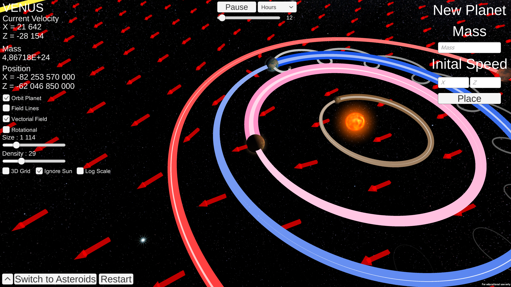
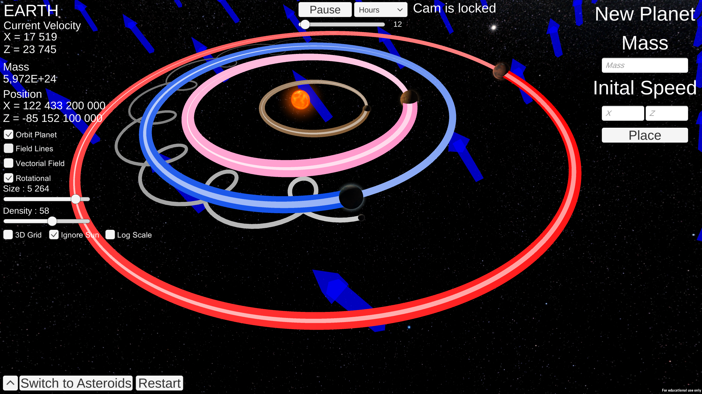
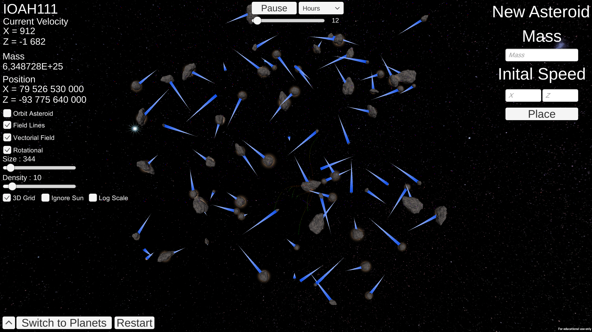

# Solar system Simulator (Gravitation study)

## Goal
The goal of this exercise was to create a solar system simulator, or more generally of a set of N celestial bodies. We are therefore interested in gravitational force fields, which are conservative vector fields.

##Features

Choice of:

   - Camera position (Free Fly Cam by Sergey Stafeev: WASD for movement, QE for up/down, mouse for orientation, shift for speed boost, acceleration).
   - Placement, mass, and initial velocity of a new planet in the system.
   - Simulation speed (in X per ticks, e.g., 120 hours per game tick).
   - Show or hide certain elements: planet information (speed, mass, position), vector field.

##Details

The constants used:

  - Universal Gravity = 6.6743e-11F

Recommended values:

  -  Simulation speed: The faster the speed, the more inaccuracies accumulate (and the larger the planet trails become). It is therefore recommended to stick to values close to the default ones.
  -  New planet: speed from 5 to 10 a.u. in z is good for orbital stability.

##Architecture

All planet calculations can be found in Astral Object. Constants and time calculations in Globals. The vector field in Vectorial Fields. The camera in Camera Behaviour & Free Fly Camera. Interfaces in Instruction Button, New Planet Placer, Planet Info & Time Controller.

## Images

_Gravitation follows the Sun if moving._

_Display of vectorial field._

_Display of rotational field._

_Display of field of lines._

_Second scene with an asteroid field._

## Written by
- <a href = "mailto: felix.becaud@gmail.com">Félix Becaud</a>
- <a href = "mailto: j.perrochaud@student.isartdigital.com">Jessica Perrochaud</a>
- <a href = "mailto: m.dero@student.isartdigital.com">Morgane Dero</a>
